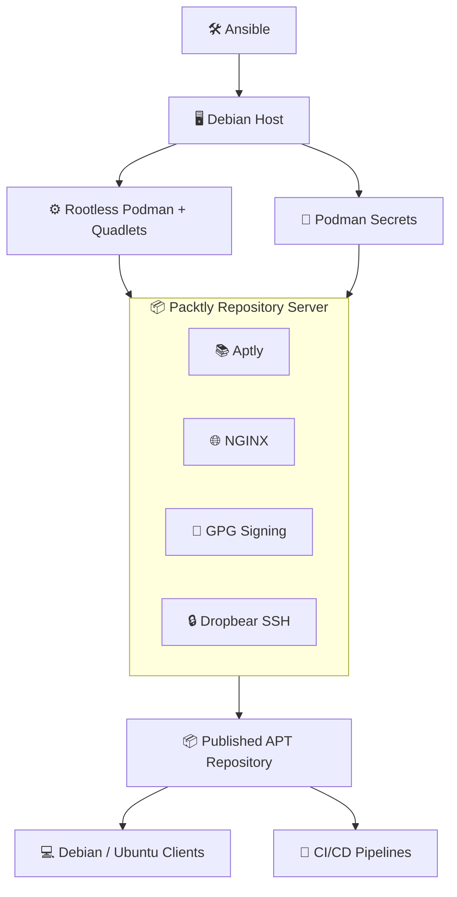

# packtly-infra

`packtly-infra` is the reference deployment for the **Packtly** platform. Using **Ansible**, it provisions Debian hosts and deploys a production-ready, self-hosted Debian package repository powered by [Aptly](https://www.aptly.info/), **rootless Podman**, and **systemd Quadlets**. It automates secure GPG signing, repository configuration, and the infrastructure required for reproducible Debian package publishing.

## Features

* Automated deployment with Ansible
* Rootless Podman containers managed by systemd Quadlets
* Aptly-based Debian package repositories
* Automatic GPG key generation, package signing, and repository metadata signing
* Secure secret management with Ansible Vault and Podman secrets
* NGINX reverse proxy for package distribution and Aptly API
* Idempotent infrastructure provisioning
* Local development environment with Podman compose

## Architecture



The deployed server exposes both the Aptly REST API and a standard Debian APT
repository, allowing packages to be published automatically by CI/CD pipelines
and consumed by Debian systems, containers, or embedded Linux build systems.

## What gets deployed?

A deployment provisions:

- a dedicated rootless service user
- Podman and systemd Quadlets
- the Packtly repository server
- Aptly package repositories
- NGINX reverse proxy
- GPG signing keys
- Podman secrets
- SSH administration
- persistent repository storage

---

## Quick Start

```bash
git clone git@github.com:packtly/packtly-infra.git
cd packtly-infra
./scripts/install-requirements
./scripts/install-ansible
```

### 1. Initialize inventory

Run the interactive wizard to create `inventories/hosts.yml` and encrypted `group_vars`:

```bash
./scripts/packtly_init.py
```

It will prompt for:
- Environment name (`dev` / `prod`)
- Target host (hostname/IP, or `localhost` for local deploy)
- Bootstrap SSH user
- Container method (`build` or `pull`) and registry settings
- Service user, ports, GPG identity, API credentials
- Vault password (used to encrypt secrets via `ansible-vault`)

### 2. Deploy

```bash
./scripts/deploy dev    # deploy to dev inventory group
./scripts/deploy prod   # deploy to prod inventory group
```

This runs the Ansible playbook against the specified `--limit` group.

> Prefer a throwaway local sandbox without touching Ansible inventories? The `just all` route is for **development only** (self-signed dev secrets, no Ansible, no real host) — run `just all` instead, see [Local Development](#local-development-justfile).

---

## Repository Layout

```
packtly-infra/
├── ansible/                     # Ansible playbook and roles
│   ├── packtly_setup.yml       # Main playbook
│   ├── generated-secrets/      # Secrets fetched locally per host (gitignored)
│   └── roles/
│       ├── container_runtime/  # pip/podman setup
│       ├── packtly_secrets/    # GPG, SSH, API secret generation
│       ├── packtly_service/    # Container deploy, volume, Quadlet service
│       └── sshconfig/          # Local ~/.ssh/config.d entry
├── inventories/
│   ├── hosts.yml                # Target hosts (generated, gitignored)
│   └── group_vars/
│       ├── dev/{local,vault}.yml   # Dev config + vault secrets (gitignored)
│       └── prod/{local,vault}.yml  # Prod config + vault secrets (gitignored)
├── packtly-infra/
│   ├── Containerfile            # Container image definition
│   ├── podman-compose.yml       # Local dev compose setup
│   └── rootfs/usr/local/bin/    # Scripts baked into the container image
│       ├── create_repo          # Create an aptly repo
│       ├── publish_repo         # Publish one or more aptly repos
│       ├── gen_gpg               # Generate repo-signing GPG key
│       ├── gen_htpasswd          # Manage API basic-auth credentials
│       ├── entrypoint_gpg        # Import GPG keys/secrets at container start
│       └── entrypoint_ssh        # Provision dropbear host keys + authorized_keys
├── scripts/                     # Host-side developer & operator tooling
│   ├── packtly_init.py          # Interactive inventory setup wizard
│   ├── deploy                   # Ansible deploy wrapper
│   ├── install-requirements     # Install pipx/system prerequisites
│   ├── install-ansible          # Install Ansible + required collections
│   ├── ansible-lint             # Run ansible-lint against the playbook/roles
│   ├── ansible-build            # Build the Ansible collection artifact
│   ├── packtly-status           # Show packtly.service status on the target host
│   ├── packtly-journal          # Tail packtly.service journal on the target host
│   ├── packtly-purge            # Remove service user + all its Podman resources
│   ├── gpg-inspect               # Inspect a generated GPG keyring
│   ├── passwd-hash               # Generate a SHA-512 crypt password hash
│   └── avedit                    # Edit an ansible-vault file in VS Code
└── justfile                     # Local dev workflow recipes
```

---

## Prerequisites

- Python 3.7+
- [pipx](https://pipx.pypa.io/)
- Podman
- Ansible + `containers.podman` collection

Install everything:

```bash
./scripts/install-requirements
./scripts/install-ansible
```

---

## Ansible Playbook

`ansible/packtly_setup.yml` contains two plays:

| Play | User | Purpose |
|---|---|---|
| Bootstrap packtly host | `bootstrap_user` (become root) | Container runtime, secrets, service user |
| Deploy packtly service | `service_user` | Container image, volume, Quadlet unit, SSH config |

### Roles

| Role | Description |
|---|---|
| `container_runtime` | Configures pip (optional proxy) |
| `packtly_secrets` | Builds setup container, generates GPG key, SSH key, API credentials, stores them locally under `ansible/generated-secrets/<host>/` |
| `packtly_service` | Creates service user, deploys container image (build or pull), provisions Podman volume with public keys and htpasswd, registers Quadlet systemd unit |
| `sshconfig` | Writes `~/.ssh/config.d/packtly-<host>` for SSH access to the running container |

---

## Inventory Structure

`inventories/hosts.yml` is generated by the wizard and gitignored. Example:

```yaml
all:
  children:
    prod:
      hosts:
        mars:
          ansible_connection: ssh
          ansible_host: mars
          bootstrap_user: user
    dev:
      hosts:
        localhost:
          ansible_connection: local
          ansible_python_interpreter: /usr/bin/python3
```

`inventories/group_vars/<env>/local.yml` holds non-secret config:

```yaml
service_user: packtly
container_name: packtly
container_method: build        # or pull
container_image_local: packtly-infra:dev
datadir: packtly_data
web_port: "8080"
ssh_port: "2222"
gpg_user: yourname
gpg_email: user@example.com
api_user: admin
```

`inventories/group_vars/<env>/vault.yml` holds ansible-vault encrypted secrets:

```yaml
ansible_become_password: ...
gpg_pass: ...
api_pass: ...
vault_container_registry_password: ...
```

---

## Local Development (justfile)

```bash
just                   # list available recipes
just all               # full local setup: build, secrets, volume, start, create repos
just setup-image       # build setup container image
just setup-rmimage     # remove the setup container image
just secrets-create    # generate GPG, SSH, API credentials into .dev-secrets/
just volume-create     # create Podman volume and Podman secrets
just volume-create recreate=true  # recreate (destroys existing data)
just volume-rm         # remove the Podman volume and secrets
just create-repos      # import GPG key and create aptly repos
just service-start     # start the packtly container and follow logs
just service-logs      # follow container logs
just service-stop      # stop the packtly container
just service-rmimage   # remove the packtly service image
just clean             # stop service, remove volume and images
just clean-all         # clean + delete .dev-secrets/
```

---

## Runtime Architecture

The container runs as a **rootless Podman** service under the `packtly` user:

- **Quadlet unit**: `~/.config/containers/systemd/packtly.container`
- **Managed by**: `systemctl --user` (scope: `service_user`)
- **Ports**: HTTP `8080` → aptly REST API + nginx repo, SSH `2222` → dropbear
- **Volume**: `packtly_data` — persists aptly DB, repos, GPG keyrings

Check service status by switching to the service user via `systemd-run`:

```bash
sudo systemd-run --system --scope su - packtly -c "systemctl --user status packtly.service"
sudo systemd-run --system --scope su - packtly -c "journalctl --user -u packtly.service -n 100 -f --no-pager"
```

On a **remote host**:

```bash
ssh packtly@<host> "systemctl --user status packtly.service"
ssh packtly@<host> "journalctl --user -u packtly.service -n 100 -f --no-pager"
```

SSH into the running container:

```bash
ssh packtly-<hostname>   # configured by sshconfig role
```

---

## APT Client Configuration

Create `/etc/apt/sources.list.d/packtly.sources`:

```ini
Types: deb
URIs: http://<host>:8080
Suites: trixie-apollo
Components: main
Signed-By: /etc/apt/trusted.gpg.d/packtly.gpg
```

Import the signing key:

```bash
curl http://<host>:8080/public/repo_signing.key \
  | gpg --dearmor \
  | sudo tee /etc/apt/trusted.gpg.d/packtly.gpg > /dev/null
```

---

## API Access

The aptly REST API is available at `http://<host>:8080/api` (basic auth):

```bash
curl -u admin:<password> http://<host>:8080/api/version
```

---

## Managing Repository Packages

SSH into the running container to use the `aptly` CLI directly:

```bash
ssh packtly-<hostname>
```

### Inspect packages in a repo

```bash
aptly repo show -with-packages trixie-apollo-contrib
```

### Remove packages

Remove a specific package by exact name and architecture:

```bash
aptly repo remove trixie-apollo-contrib debhello_1.0.0_amd64
```

Wildcard removal (all architectures of a version):

```bash
aptly repo remove trixie-apollo-contrib debhello_1.0.0_*
```

Remove the source package:

```bash
aptly repo remove trixie-apollo-contrib debhello_1.0.0_source
```

Remove a debug symbol package:

```bash
aptly repo remove trixie-apollo-contrib debhello-dbgsym_1.0.0_amd64
```

> After removing packages, republish the affected snapshot/repo so clients see the updated state.

Republish with the container's `publish_repo` helper (comma-separate multiple repo names; the `-component=","` flag is only added automatically when publishing more than one repo):

```bash
ssh packtly-<hostname> publish_repo -r trixie-apollo-main,trixie-apollo-contrib
```

---

## Operational Scripts

Host-side scripts under `scripts/` for day-to-day operation of a deployed host:

| Script | Purpose |
|---|---|
| `scripts/packtly-status` | Show `packtly.service` status as the `packtly` user |
| `scripts/packtly-journal` | Tail the last 60 lines of the `packtly.service` journal (follow with `-f`) |
| `scripts/packtly-purge` | **Destructive.** Stops the service and removes the service user's Podman containers, images, volumes, secrets, and networks. Prompts for confirmation. Run as root: `sudo scripts/packtly-purge [service_user] [service_name]` |
| `scripts/gpg-inspect` | Print public/secret GPG keys from a generated keyring (defaults to `ansible/generated-secrets/localhost/gpg`) |
| `scripts/passwd-hash` | Generate a SHA-512 crypt hash for a password: `scripts/passwd-hash <password>` |
| `scripts/avedit` | Open an `ansible-vault`-encrypted file for editing in VS Code |

Container-side CLI scripts baked into the image (`packtly-infra/rootfs/usr/local/bin/`), available over SSH into the running container:

| Script | Purpose |
|---|---|
| `create_repo -d <codename> [-c component] [-n name] [-m comment]` | Create an aptly repo if it doesn't already exist |
| `publish_repo -r <repo1,repo2,...> [-k keyid] [-p passfile]` | Sign and publish one or more aptly repos |
| `gen_gpg -n <name> -e <email> -p <passphrase>` | Generate the repo-signing GPG keypair (used by `packtly_secrets` role / `just secrets-create`) |
| `gen_htpasswd <user> <pass>` | Add/update a user in the API's `.htpasswd` file |
| `entrypoint_gpg` | Imports the GPG signing keys from Podman secrets at container startup |
| `entrypoint_ssh` | Generates dropbear host keys and populates `authorized_keys` at container startup |

---

## Secrets & Security

- All secrets are generated inside the temporary setup container — nothing is generated on the control node.
- GPG private key and passphrase are stored as **Podman secrets** (`packtly_gpg_private_key`, `packtly_gpg_passphrase`) — never written to the container filesystem.
- Local generated secrets are stored under `ansible/generated-secrets/<host>/` and are gitignored.
- Vault variables are encrypted with `ansible-vault` and must be decrypted at deploy time with `--ask-vault-pass`.

---

## Related Projects

| Project | Description |
|----------|-------------|
| packtly | Project overview |
| packtly-builder | Debian package build toolkit |
| packtly-infra | Infrastructure automation (this repo) |

